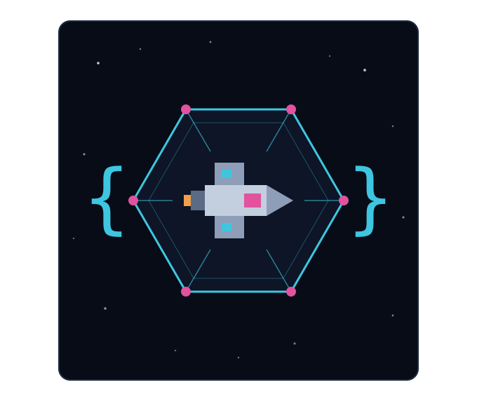

<div align="center">



# Automation API

**An Avorion server mod that turns your fleet into a JSON API.**

Read your ships, captain missions and map knowledge over HTTP, so an external program can
plan and dispatch mining, trading and salvage runs instead of you clicking through the
galaxy map.

[](https://steamcommunity.com/sharedfiles/filedetails/?id=3799355928)
[](https://www.avorion.net/)
[](modinfo.lua)
[](#install)
[](#how-it-talks-to-the-outside-world)
[](LICENSE)

[**Workshop**](https://steamcommunity.com/sharedfiles/filedetails/?id=3799355928) · [**API reference**](docs/api.md) · [**Protocol**](docs/protocol.md) · [**Bridge guide**](docs/external.md) · [**Web console**](#web-console)

</div>

---

- read your fleet, including craft in unloaded sectors and while you are offline
- preview a captain mission with the game's own yield and risk prediction, then start it
- move ships across the galaxy, or give in-sector orders, and watch what they actually do
- query known sectors, and predict unvisited ones straight from the galaxy seed

## How it talks to the outside world

It cannot open a socket, and neither can any other Avorion mod. The game's Lua sandbox nils
out `os.execute`, `io.popen`, `os.getenv` and `package.loadlib`, ships PUC Lua 5.2 rather
than LuaJIT (so no `ffi`), and links neither libcurl nor OpenSSL. There is no HTTP or socket
type anywhere in the scripting API.

So the mod speaks JSON over files in the galaxy's `moddata/` folder, and a small process on
the same machine turns that into HTTP. Everything that matters - routing, authentication,
validation, serialization - lives in the mod, which keeps that process down to about 150
lines in any language.

```
your planner ──HTTP──▶ bridge process ──files──▶ moddata/AutomationAPI/ ──▶ the mod
```

The mod ships no bridge process; you run one. [docs/external.md](docs/external.md) is the
guide to writing it, with a complete reference implementation.

## Install

### 1. Get the mod into the galaxy

**From the Workshop.** Put the Workshop ID in the galaxy's `modconfig.lua` and the server
downloads and updates the mod itself:

```lua
mods = {
    {workshopid = "3799355928"}
}
```

**From this repo.** Clone it anywhere and point at the folder **by path** - a local copy
has no Workshop ID to resolve:

```lua
mods = {
    {path = "/absolute/path/to/avorion-automation-api"}
}
```

For a dedicated server `modconfig.lua` lives in the galaxy folder, e.g.
`~/.avorion/galaxies/defaultgalaxy/modconfig.lua`.

### 2. Start the server and take a key

Start it. The log should show `Found 1 mods` and then `AutomationAPI: v0.1.5 ready`.

In game, run `/apikey new` to get a key. It is shown once. To let non-admins run the
command, add `<command name="apikey"/>` to `defaultAuthorizationGroup` in
`<galaxy>/admin.xml`.

The mod is `serverSideOnly`, so clients do not download it and do not need it installed.

### 3. Run a bridge process

This part the Workshop cannot do for you. The mod has no socket of its own, so nothing
answers HTTP until a bridge process is running beside the server - either the Docker stack
in [`docker/`](docker/) or your own, per [docs/external.md](docs/external.md). Until then
the API is reachable only over the file transport shown below.

## First request

Without a bridge process, straight against the file transport:

```bash
DIR=~/.avorion/galaxies/defaultgalaxy/moddata/AutomationAPI
ID=$(uuidgen | tr -d -)

# write to a name the mod ignores, then rename it into place
cat > "$DIR/requests/$ID.part.json" <<JSON
{"id":"$ID","key":"avo_...","method":"GET","path":"/ping"}
JSON
mv "$DIR/requests/$ID.part.json" "$DIR/requests/$ID.json"

until python3 -c "import json,sys;json.load(open(sys.argv[1]))" "$DIR/responses/$ID.json" 2>/dev/null
do sleep 0.1; done
cat "$DIR/responses/$ID.json"; rm "$DIR/responses/$ID.json"
```

## Web console

`web/` is a browser console for the API - fleet overview, captain missions, orders,
travel, a galaxy map and a live per-ship event log. It is plain HTML and JavaScript with
no build step and no CDN, and all of its logic runs in the browser: it holds your key,
talks to the API directly and stores nothing on a server.

The Docker stack in `docker/` serves it from the API's own origin:

```bash
cd docker
cp .env.example .env      # point GALAXY_DIR at the directory holding moddata/
docker compose up -d --build
```

Start the game server first. The mod creates the transport directory and owns it, and the
server console says which one it picked - `GALAXY_DIR` is that path with
`/moddata/AutomationAPI` taken off the end. Point it somewhere else and Docker will make
the directory itself rather than failing, at which point nothing can write to it; the
bridge answers `bridge_unavailable` or `transport_not_writable` and says so.

`tools/e2e.sh` tests the whole deployment - mounts, ownership, round trip - without
Avorion, by running the real mod code against a throwaway directory.

Then open `http://<your-api-host>/console/` and paste an API key. The address field is
already filled in with the page's own origin, so there is nothing else to set.

You can also just open `web/index.html` off disk, but then the page and the API are
different origins and the browser has to be let through. The bridge sends the CORS
headers for that by default (`CORS_ORIGIN` in `.env` narrows or disables them), which
includes the one Chrome wants before a page off your disk may reach an address on your
own network. A bridge built before those headers existed refuses the page with no usable
error - rebuild it. Serving the console from `/console/` sidesteps the whole question.

## Endpoints

Full reference in [docs/api.md](docs/api.md).

| endpoint | |
|---|---|
| `GET /ping` | service metadata and API version |
| `GET /ships` | owned craft, with the usability check every mission runs first |
| `GET /ships/{name}` | captain, crew, cargo, turrets, systems, hyperspace, requirements |
| `GET /missions`, `GET /ships/{name}/missions` | mission catalog, resolved for one ship |
| `POST /ships/{name}/missions/{mission}/preview` | dry run with the game's own prediction |
| `POST /ships/{name}/missions/{mission}/start` | start it |
| `GET /ships/{name}/mission` | live status |
| `POST /ships/{name}/mission/recall`, `.../collect` | recall, and collect yields |
| `POST /ships/{name}/travel` | send a ship anywhere in the galaxy |
| `POST /ships/{name}/orders` | in-sector order chain: jump, patrol, repair, mine, ... |
| `GET /ships/{name}/events` | what the ship has actually been doing |
| `GET /galaxy/info`, `GET /galaxy/route` | galaxy shape, and the game's own pathfinder |
| `GET /map/sectors`, `GET /map/sectors/{x}/{y}` | known sectors |
| `GET /map/predict/{x}/{y}`, `GET /map/search` | unvisited sectors, from the seed |

## What needs the owner online

Every read works with nobody logged in, because the bridge runs on the Galaxy.

Writes do not. Starting, recalling and collecting missions, travel and in-sector orders all
answer `409 owner_offline` when the owning player is not in game, and the ship event feed
records nothing then either. That is a vanilla limitation rather than a shortcut here:
mission state lives in a player script, and captain missions do not tick for offline players
in the base game.

## Documentation

| | |
|---|---|
| [docs/api.md](docs/api.md) | every endpoint, its parameters and response shape |
| [docs/protocol.md](docs/protocol.md) | the file transport, envelopes, status codes, auth |
| [docs/external.md](docs/external.md) | writing the bridge process and clients against it |

## Architecture

Two scripts, because the game forces the split:

- `data/scripts/galaxy/automationapi/bridge.lua` runs on the Galaxy, so it ticks whether or
  not anyone is logged in. It owns the transport, auth, routing and every read.
- `data/scripts/player/automationapi/agent.lua` runs on the Player. Everything that writes
  goes through it, and it forwards ship order and status callbacks back to the bridge.

The split is not a style choice. A galaxy script calling `Player:invokeFunction` **segfaults
the server** - no error, no return code, the process dies. Verified against 2.5.13 with the
exact call shape vanilla uses, and every vanilla caller of the background simulation is a
player script. So the bridge parks a job and the agent, running in the one context where the
call is legal, executes it and reports back.

Everything else is pure Lua under `data/scripts/lib/automationapi/`: the JSON codec, router,
auth, serializers and the per-endpoint handlers.

Both vanilla overlays exist only to add one `addScriptOnce` line each:
`data/scripts/galaxy/init.lua` attaches the bridge, `data/scripts/player/init.lua` attaches
the agent. They are the only vanilla files this mod replaces, and they need re-checking
against the game's copies after an Avorion update.

## Development

The pure-Lua modules run outside the game against a mocked Avorion environment:

```bash
for t in bridge ships missions movement map shipevents; do lua5.4 tests/test_$t.lua; done
```

`tests/mock_avorion.lua` deliberately reproduces the sandbox's hostile behaviour rather
than a convenient version of it, so bugs that would otherwise only show up in game fail in
tests instead. It reproduces, among others:

- `os.rename` reporting success and then losing the file
- `Player:invokeFunction` being fatal outside a player script
- engine enums being userdata that `pairs()` will not iterate
- `sectorspecifics` exposing its static functions only through an instance
- `orderchain` reaching only functions the game marks `callable()`
- a captured owner handle serving a cached `ShipInfo` that never advances
- `Simulation.getCommandUIData` raising for an idle ship, traceback and all

## Security

An API key identifies exactly one player, and every request acts as that player. Keys are
stored in plaintext in the galaxy's globals file, deliberately: anyone who can read that
file can already read and write the request directory, which is full control of this API.
Treat filesystem access to the galaxy folder as equivalent to holding every key, and keep
the bridge process bound to localhost.

## License

GPL-3.0. See [LICENSE](LICENSE).

---

<div align="center">

<sub>Built for <a href="https://www.avorion.net/">Avorion</a> 2.5+ · <a href="https://steamcommunity.com/sharedfiles/filedetails/?id=3799355928">Steam Workshop</a> · <a href="https://github.com/Rustypredator/avorion-automation-api/issues">Issues</a></sub>

</div>
